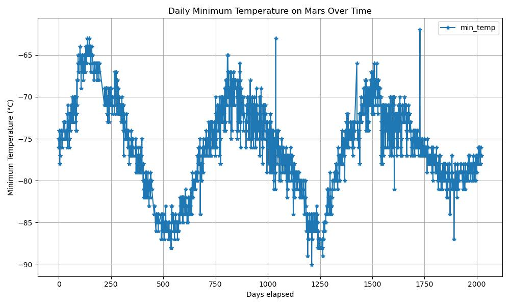
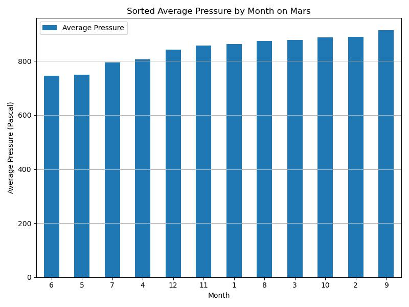

# mars-challenge
Challenge 11 - by Olga Petrova

### Data analysis of Mars Data

For this project I used this website: [Mars Data](https://static.bc-edx.com/data/web/mars_news/index.html#)

1. There are 12 month on Mars
2. Number of Sols in the data set on Mars is 1867
3. Coldest month on Mars is month number 3. The temperature reaches -83.31 C
   Warmest month on Mars is month number 8. The temperature reaches -68.38 C
   
4. By observing this graph and comparing dates with minimum and maximum temperatures, I estimate Martian year to be a little less then 700  terrestial days.
   
5. Atmospheric Pressure:
   Month when the pressure is lowest on Mars is 6. The pressure reaches 745.05 Pascal.
   Month when the pressure is highest on Mars is 9. The pressure reaches 913.30 Pascal.

    

